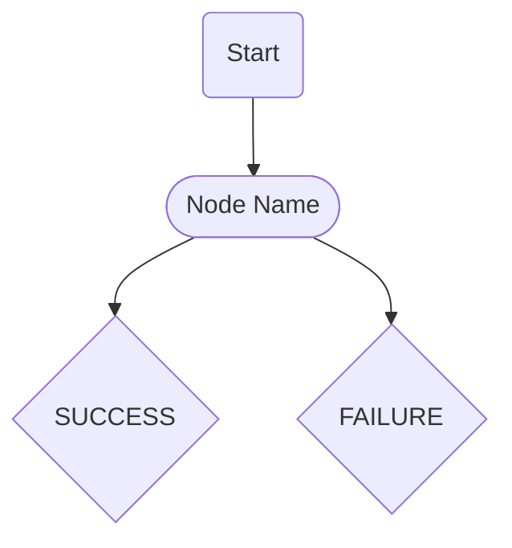

# CONTENT_TEMPLATES.md  
> **Purpose** – Author-ready MDX templates & content map for the **FaceSign API documentation site**.  
> Copy any section you need, fill the _place-holders_ (`[...]`), and drop the file into `facesign-api/docs/`.

---

## Table of Contents

1. [Getting Started](#1-getting-started)  
2. [Core Concepts](#2-core-concepts)  
3. [SDK Client Methods](#3-sdk-client-methods)  
4. [Node Types Reference](#4-node-types-reference)  
5. [Data Models](#5-data-models)  
6. [SDK Reference](#6-sdk-reference)  
7. [Code Examples](#7-code-examples)  
8. [Guides & Best Practices](#8-guides--best-practices)  
9. [Operational Reference](#9-operational-reference)  
10. [Meta](#10-meta)

---

## 1. Getting Started
| Page | Purpose |
|------|---------|
| **Installation** | Show `npm`, `yarn`, and CDN ways to install SDK; list peer deps. |
| **Authentication** | Explain API keys, dashboard creation, JWT / Bearer; include curl snippet that fails without creds. |
| **Quick Start** | "Hello FaceSign" – create session, collect client secret, open hosted flow. |
| **Error Handling** | JSON error schema, retry rules, sample 4xx/5xx bodies with `<CodeBlock language="http">`. |
| **Environment Setup** | List required env vars, .env example, CLI for local tunnel. |

---

## 2. Core Concepts
| Concept | Key Points |
|---------|-----------|
| **Sessions** | Lifecycle diagram (mermaid) + status enum. |
| **Modules** | Legacy vs Node graph; deprecation note. |
| **Client Secrets** | TTL, single-use vs multi-use, revoke API. |
| **Node Graph** | How FSNodeType builds a DAG; branching rules. |
| **Webhooks** | Event delivery, retry, signature header. _NEW_ |
| **Rate Limits** | Global per-key & burst; how to interpret `X-RateLimit-*` headers. _NEW_ |

---

## 3. SDK Client Methods
Create one MDX file **per method** using the template in [📑 SDK Method Template](#sdk-method-template).  
Add auto-generated API reference table via `nextra/components` `<ApiTable>` if desired.

---

## 4. Node Types Reference
Group nodes by domain:

| Sub-section | Nodes |
|-------------|-------|
| **Control** | Start, End, Conversation, Data Validation |
| **Authentication** | Two-Factor, Enter Email |
| **Biometric** | Face Scan, Recognition, Liveness |
| **Document** | Document Scan (ID, Passport, Barcode) |

Each node page follows the [📑 Node Type Template](#node-type-template).

---

## 5. Data Models
Document every exported TypeScript interface / enum.

| Category | Types |
|----------|-------|
| **Session** | `Session`, `SessionSettings`, `SessionReport`, `SessionStatus` |
| **Module (legacy)** | … |
| **Customization** | `Customization`, `PermissionsPageCustomization`, `ControlsCustomization` |
| **Common** | `ClientSecret`, `Location`, `Device`, `Phrase` |

Include a table of breaking changes vs previous API versions.

---

## 6. SDK Reference
High-level constructor & configuration page, then link to individual methods.

---

## 7. Code Examples
Author scenario-driven tutorials with the [📑 Code Example Template](#code-example-template).

1. **Basic Session** – minimal config.  
2. **Auth Flows** – email, SMS, 2FA.  
3. **Biometric** – face scan + liveness.  
4. **Document Scan** – single-side vs multi-side capture.  
5. **Webhook Consumer** – verify signature and update DB. _NEW_

---

## 8. Guides & Best Practices
* Security (key storage, rotating secrets, GDPR).  
* Performance (keep-alive, batching, CDN image endpoints).  
* Error Recovery (idempotent retries, back-off).  
* Testing & Sandbox vs Prod.  
* Multi-language snippets (TS, JS, Python, Go). _NEW_  
* Accessibility & UI customization with shadcn/ui. _NEW_

---

## 9. Operational Reference
* **Changelog** – calver or semver, migration notes.  
* **Error Codes** – sortable MDX table (`code`, `httpStatus`, `message`, `cause`).  
* **Rate Limits** – duplicated quick chart.  
* **Service Status** – link to status page. _NEW_  
* **Deprecation Policy** – timeline & sunset headers. _NEW_

---

## 10. Meta
* **Glossary** – acronyms & terms.  
* **FAQ** – common onboarding questions.  
* **Support & SLA** – email, chat, paid tiers.  
* **License** – MIT / proprietary note.  
* **Contributing Docs** – how to open PRs for doc fixes. _NEW_

---

## SDK Method Template
```mdx
---
title: "[Method Name]"
description: "[One-sentence meta description for SEO]"
---

import { Tabs } from 'nextra/components'
import { CodeBlock } from '@/components/CodeBlock'
import { Callout } from '@/components/Callout'  // shadcn-style callout

# [Method Name]

[Brief description of what this method does]

## Syntax
```typescript
client.[scope].[methodName](params: ParamType): Promise<ResponseType>
```

## Parameters

| Name | Type | Required | Description |
|------|------|----------|-------------|
| param1 | string | ✅ | … |

## Return Value

Promise<ResponseType>

### Response Schema

```typescript
interface ResponseType {
  [...]
}
```

## Examples

<Tabs items={['TypeScript', 'JavaScript', 'Python']}>
  <Tabs.Tab>
```typescript
import { FaceSignClient } from '@facesignai/api'

const client = new FaceSignClient({ auth: process.env.FS_KEY })
const res = await client.[scope].[methodName]({ ... })
```
  </Tabs.Tab>
  <Tabs.Tab>
```javascript
const { FaceSignClient } = require('@facesignai/api')

const client = new FaceSignClient({ auth: process.env.FS_KEY })
const res = await client.[scope].[methodName]({ ... })
```
  </Tabs.Tab>
  <Tabs.Tab>
```python
from facesign import FaceSignClient

client = FaceSignClient(auth=os.environ['FS_KEY'])
res = client.[scope].[method_name](...)
```
  </Tabs.Tab>
</Tabs>

<Callout type="info" title="Idempotency">
  This endpoint is idempotent when you pass the same <code>idempotencyKey</code>.
</Callout>

## Errors

| Code | HTTP | Description | Retry? |
|------|------|-------------|--------|
| E_SESSION_NOT_FOUND | 404 | Session ID is invalid | ❌ |

## Related
- [Other Method]
```

---

## Node Type Template
```mdx
---
title: "[Node Type Name]"
---

import { Card, CardContent, CardHeader, CardTitle } from '@/components/ui/card'
import { Tabs } from 'nextra/components'

# [Node Type Name]

[Overview of node purpose and use cases]

## Diagram


## Type Definition

```typescript
interface FS[NodeType]Node extends FSNodeBase {
  type: FSNodeType.[NODE_NAME]
  [...]
}
```

## Properties

| Property | Type | Required | Default | Description |
|----------|------|----------|---------|-------------|
| id | string | ✅ | – | Unique identifier |

## Outcomes

| Outcome | Value | Description |
|---------|-------|-------------|
| SUCCESS | "success" | User completed … |

## Config Examples

<Tabs items={['Basic', 'Advanced']}>
  <Tabs.Tab>
  <Card>
    <CardHeader><CardTitle>Basic</CardTitle></CardHeader>
    <CardContent>
```typescript
{
  type: FSNodeType.[NODE_NAME],
  id: 'node-1'
}
```
    </CardContent>
  </Card>
  </Tabs.Tab>
  <Tabs.Tab>
  <Card>
    <CardHeader><CardTitle>Advanced</CardTitle></CardHeader>
    <CardContent>
```typescript
{
  type: FSNodeType.[NODE_NAME],
  id: 'node-1',
  retry: 3,
  onFailure: 'end'
}
```
    </CardContent>
  </Card>
  </Tabs.Tab>
</Tabs>

## Usage Notes
- Works only after a successful Face Scan.
- Consumes ~1 credit per invocation.
```

---

## Code Example Template
```mdx
---
title: "[Example Name]"
---

import { Alert, AlertTitle, AlertDescription } from '@/components/ui/alert'
import { Tabs } from 'nextra/components'
import { Info } from 'lucide-react'

# [Example Name]

[Concise overview]

## Prerequisites
- **FaceSign API key**
- Node ≥ 18
- [...]

## Implementation
<Tabs items={['TypeScript', 'JavaScript', 'Python']}>
  <Tabs.Tab>
```typescript
import { FaceSignClient } from '@facesignai/api'

const client = new FaceSignClient({ auth: 'YOUR_API_KEY' })
await client.session.create({ ... })
```
  </Tabs.Tab>
  <Tabs.Tab>
```javascript
const { FaceSignClient } = require('@facesignai/api')

const client = new FaceSignClient({ auth: 'YOUR_API_KEY' })
await client.session.create({ ... })
```
  </Tabs.Tab>
  <Tabs.Tab>
```python
from facesign import FaceSignClient

client = FaceSignClient(auth='YOUR_API_KEY')
client.session.create(...)
```
  </Tabs.Tab>
</Tabs>

<Alert>
  <Info className="h-4 w-4" />
  <AlertTitle>Heads-up</AlertTitle>
  <AlertDescription>
    Remember to rotate your <code>clientSecret</code> every 24 hours.
  </AlertDescription>
</Alert>

## Next Steps
- [Advanced Session Options]
```

---

## MVP Priorities

| Phase | Deliverables |
|-------|--------------|
| **1 (Core)** | Quick Start, Auth, Basic Session, Intro Node reference, Error handling |
| **2 (Essentials)** | All SDK methods, Full Node docs, Module config, Session lifecycle, Core data models |
| **3 (Advanced)** | Security, Multilang snippets, Custom UI, Performance, Rich code examples |
| **4 (Reference)** | Full TS definitions, Error codes, Rate limits, Changelog, Versioning guide |

---

## How to Use This File
1. Create pages using the templates above.  
2. Replace placeholder text (square brackets) with real content.  
3. Save pages under the structure defined in the Implementation Plan.  
4. Commit & preview locally (`pnpm dev`).  

Happy writing! ✍️