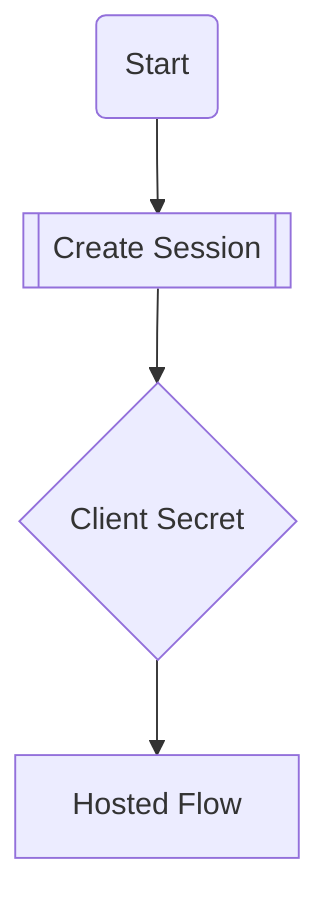

# CONTENT_TEMPLATES.md  
> MDX scaffolds & file map for the **FaceSign Astro + Starlight** docs.  
> Copy, replace `[placeholders]`, save under `src/content/`, commit.

---

## 0 · Directory & Sidebar Map

```
src/content/
├─ getting-started.mdx
├─ concepts.mdx
├─ guides/
│   └─ webhooks.mdx
├─ examples/
│   ├─ basic-session.mdx
│   └─ rest-client.mdx        # links .http file
└─ _sidebar.yaml
```

Keep depth ≤ 1 to maintain never-collapsed nav.

---

## 1 · Front-matter Cheat-Sheet

```yaml
---
title: "[Page Title]"
description: "[One-sentence SEO meta]"
# optional: layout, ogImage …
---
```

---

## 2 · Page Templates

### 2.1 Getting Started (getting-started.mdx)

```mdx
---
title: "Getting Started"
description: "Install the SDK, set your API key, and create your first session."
---

import { Callout } from '@/components/ui/callout'
import { Tabs } from '@astrojs/starlight/components'

# 🚀 Quick Start

## 1 · Install

```bash
pnpm add @facesignai/api
```

## 2 · Authenticate

```bash
export FS_KEY=sk_test_...
```

## 3 · Create a session

<Tabs values={[
  { label: 'cURL', value: 'curl' },
  { label: 'TypeScript', value: 'ts' },
  { label: 'Python', value: 'py' }
]}>
<Tabs.Panel value="curl">

```bash
curl -X POST https://api.facesign.ai/sessions \
  -H "Authorization: Bearer $FS_KEY"
```

</Tabs.Panel>
<Tabs.Panel value="ts">

```typescript
import { FaceSignClient } from '@facesignai/api'
const client = new FaceSignClient({ auth: process.env.FS_KEY })
const session = await client.session.create()
```

</Tabs.Panel>
<Tabs.Panel value="py">

```python
from facesign import FaceSignClient
client = FaceSignClient(auth='$FS_KEY')
session = client.session.create()
```

</Tabs.Panel>
</Tabs>

<Callout type="info" title="Sandbox vs Production">
  Calls default to **sandbox**. Switch base URL for production.
</Callout>
```

---

### 2.2 Core Concepts (concepts.mdx)

```mdx
---
title: "Sessions & Client Secrets"
---

## Session lifecycle



1. **Create** – `POST /sessions`
2. **Client secret** – returned in response
3. **User completes flow** – hosted or SDK UI
4. **Webhook** – listen for `session.completed`
```

---

### 2.3 Guide / Best Practice (`guides/webhooks.mdx`)

```mdx
---
title: "Webhook Signature Verification"
---

import { Alert } from '@/components/ui/alert'
import { ShieldCheck } from 'lucide-react'

# Verify webhook signatures

<Alert variant="warning">
  <ShieldCheck className="w-4 h-4 inline" /> Always verify the
  <code>x-facesign-signature</code> header.
</Alert>

## Node example

```ts
import crypto from 'node:crypto'

export function verify(sig: string, body: string, secret: string) {
  const h = crypto
    .createHmac('sha256', secret)
    .update(body, 'utf8')
    .digest('hex')
  if (h !== sig) throw new Error('Bad signature')
}
```
```

---

### 2.4 Code Example (`examples/basic-session.mdx`)

```mdx
---
title: "Basic Session (TypeScript)"
---

```ts
import { FaceSignClient } from '@facesignai/api'

const client = new FaceSignClient({ auth: process.env.FS_KEY })
await client.session.create({
  clientReferenceId: 'user-123'
})
```
```

---

### 2.5 REST Client Playground (`examples/rest-client.mdx`)

```mdx
---
title: "VS Code REST Client Examples"
description: "Run FaceSign API calls directly from your editor."
---

import { Button } from '@/components/ui/button'

# REST Client Examples

Download the `.http` file and run requests in  
[VS Code REST Client](https://marketplace.visualstudio.com/items?itemName=humao.rest-client).

<Button as="a" href="/openapi-example.http" download>
  Download openapi-example.http
</Button>
```

*(Ensure `openapi-example.http` is in `public/`.)*

---

## 3 · MVP Checklist

| Section | Must-have pages |
|---------|-----------------|
| **Getting Started** | Installation · Quick Start · Authentication · Error Handling |
| **Core Concepts** | Sessions · Client Secrets · Node Graph |
| **Guides** | Webhooks · Rate Limits · Security |
| **Examples** | Basic Session · REST Client |
| **API Reference** | Generated from `openapi.yaml` |
| **Meta** | Changelog · FAQ · Support |

---

## 4 · How to Use

1. Choose a template above.
2. Replace `[placeholders]` with real copy / code.
3. Save file under `src/content/…`.
4. Update `_sidebar.yaml` (flat list).
5. `pnpm dev`, verify, commit, push.

Happy writing! ✍️ 