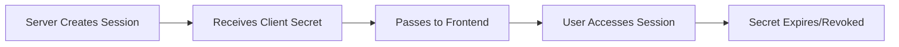

# Client Secrets

Client secrets are temporary, secure tokens that allow end users to access and complete their verification sessions without exposing your API key.

## What is a Client Secret?

A client secret is:
- **Temporary** - Expires after a set period (default: 24 hours)
- **Session-specific** - Each secret is tied to exactly one session
- **Safe for frontend** - Can be safely transmitted to end users
- **Revocable** - Can be invalidated at any time

## Client Secret Lifecycle



## Creating Client Secrets

Client secrets are automatically created when you create a session:

```typescript
const { session, clientSecret } = await client.session.create({
  clientReferenceId: 'user-123',
  metadata: {},
  flow: { /* ... */ }
})

// Response includes:
// clientSecret.secret - The secret token
// clientSecret.url - Pre-built verification URL
// clientSecret.expireAt - Expiration timestamp
```

## Using Client Secrets

### Option 1: Hosted Verification Page

The simplest approach - redirect users to the pre-built URL:

```javascript
// Backend
const { clientSecret } = await client.session.create({...})

// Frontend
window.location.href = clientSecret.url
// Example: https://verify.facesign.ai/s/cs_test_abc123
```

### Option 2: Embedded SDK

Embed the verification flow in your application:

```javascript
// Backend - Pass only the secret to frontend
res.json({ 
  clientSecret: clientSecret.secret 
})

// Frontend
import { FaceSignVerify } from '@facesignai/verify'

const verify = new FaceSignVerify({
  clientSecret: 'cs_test_abc123',
  onComplete: (session) => {
    console.log('Verification complete:', session.id)
  },
  onError: (error) => {
    console.error('Verification failed:', error)
  }
})

verify.mount('#verify-container')
```

### Option 3: Custom Integration

Build your own UI using the client secret:

```javascript
// Frontend WebSocket connection
const ws = new WebSocket('wss://ws.facesign.ai/session')

ws.onopen = () => {
  ws.send(JSON.stringify({
    type: 'authenticate',
    clientSecret: 'cs_test_abc123'
  }))
}

ws.onmessage = (event) => {
  const data = JSON.parse(event.data)
  if (data.type === 'authenticated') {
    // Begin verification flow
  }
}
```

## Security Properties

### Temporary Access

Client secrets expire automatically:

```typescript
interface ClientSecret {
  secret: string      // cs_test_abc123...
  createdAt: number   // Unix timestamp
  expireAt: number    // Unix timestamp (24 hours later)
  url: string         // https://verify.facesign.ai/s/...
}
```

### Scope Limitations

Client secrets can only:
- ✅ Access the specific session
- ✅ Submit user responses
- ✅ Upload required media (photos, documents)
- ✅ Receive session status updates

Client secrets cannot:
- ❌ Create new sessions
- ❌ Access other sessions
- ❌ Modify session configuration
- ❌ Access your account data

### One-Time Actions

Some actions invalidate the client secret:
- Completing the verification flow
- Explicit cancellation
- Session expiration

## Refreshing Client Secrets

Generate a new client secret for an existing session:

```typescript
// Backend only - requires API key
const newSecret = await client.session.refresh({ 
  sessionId: 'session_abc123' 
})

// Returns new ClientSecret object
console.log({
  secret: newSecret.secret,
  expireAt: newSecret.expireAt
})
```

Common use cases:
- User returns after secret expired
- Implementing "resend link" functionality
- Security rotation

## Best Practices

### 1. Never Store Client Secrets

```javascript
// ❌ Don't store in database
await db.sessions.insert({
  clientSecret: clientSecret.secret // Don't do this
})

// ✅ Only store session ID
await db.sessions.insert({
  sessionId: session.id,
  userId: user.id
})
```

### 2. Validate Before Sharing

```javascript
app.get('/api/session/:id/secret', authenticate, async (req, res) => {
  // Verify user owns this session
  const dbSession = await db.sessions.findOne({
    sessionId: req.params.id,
    userId: req.user.id
  })
  
  if (!dbSession) {
    return res.status(403).json({ error: 'Access denied' })
  }
  
  // Generate fresh secret
  const clientSecret = await client.session.refresh({
    sessionId: req.params.id
  })
  
  res.json({ clientSecret })
})
```

### 3. Handle Expiration Gracefully

```javascript
// Frontend
async function startVerification(sessionId) {
  try {
    const { clientSecret } = await getClientSecret(sessionId)
    window.location.href = clientSecret.url
  } catch (error) {
    if (error.code === 'SECRET_EXPIRED') {
      // Request new secret
      const { clientSecret } = await refreshClientSecret(sessionId)
      window.location.href = clientSecret.url
    } else {
      throw error
    }
  }
}
```

### 4. Monitor Usage

Track client secret generation for security:

```javascript
async function generateClientSecret(sessionId, userId) {
  // Check rate limits
  const recentCount = await db.secretLogs.count({
    userId,
    timestamp: { $gt: Date.now() - 3600000 } // Last hour
  })
  
  if (recentCount > 10) {
    throw new Error('Too many secret requests')
  }
  
  // Generate secret
  const clientSecret = await client.session.refresh({ sessionId })
  
  // Log for audit
  await db.secretLogs.insert({
    userId,
    sessionId,
    timestamp: Date.now(),
    ip: req.ip
  })
  
  return clientSecret
}
```

## URL Structure

Client secret URLs follow a consistent pattern:

```
https://verify.facesign.ai/s/{client_secret}
```

Optional parameters:
- `?lang=es` - Set language
- `?redirect_url=https://...` - Post-completion redirect
- `?theme=dark` - UI theme

Example:
```
https://verify.facesign.ai/s/cs_test_abc123?lang=es&redirect_url=https://app.example.com/complete
```

## Troubleshooting

### Common Issues

**"Invalid client secret"**
- Secret may have expired
- Session might be completed/cancelled
- Typo in the secret value

**"Session not found"**
- Session was deleted
- Wrong environment (test vs live)

**"Access denied"**
- Client secret doesn't match session
- Session configuration issue

### Debug Information

```javascript
// Backend - Get session status
const session = await client.session.get({ sessionId })

console.log({
  status: session.status,
  createdAt: new Date(session.createdAt * 1000),
  clientSecretValid: session.clientSecret?.expireAt > Date.now() / 1000
})
```

## Next Steps

- [Session Lifecycle](/concepts/sessions)
- [Security Best Practices](/guides/security)
- [Embedded SDK Guide](/guides/embedded-sdk) 