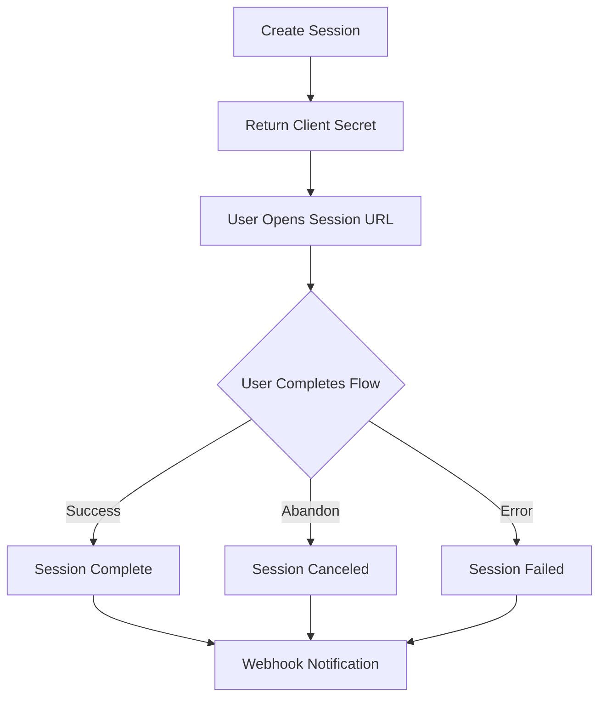

import { Code } from '@astrojs/starlight/components';

# Sessions & Client Secrets

Sessions are the core resource in the FaceSign API. Each session represents a single identity verification flow that a user completes.

## Session Lifecycle



### Session States

A session progresses through these states:

1. **`requiresInput`** - Initial state, waiting for user to begin
2. **`processing`** - User is actively completing the verification flow
3. **`complete`** - User successfully completed all verification steps
4. **`canceled`** - User abandoned the session or it expired

## Creating Sessions

Sessions are created server-side using your API key:

```typescript
const { session, clientSecret } = await facesignClient.session.create({
  clientReferenceId: 'user-123',
  metadata: {
    customerId: 'cus_abc123',
    purpose: 'account-opening'
  },
  flow: {
    // Node-based flow configuration
  }
})
```

### Required Fields

- **`clientReferenceId`** - Your internal identifier for this verification
- **`metadata`** - Custom data object (max 50KB) for your reference

### Optional Fields

- **`flow`** - Node-based flow configuration (recommended)
- **`modules`** - Legacy module configuration (deprecated)
- **`customization`** - UI/UX customization options
- **`providedData`** - Pre-fill user data
- **`langs`** - Available languages
- **`zone`** - Geographic zone (`es` or `eu`)

## Client Secrets

Each session returns a client secret that enables secure access from your frontend:

```json
{
  "secret": "cs_test_abc123xyz",
  "createdAt": 1234567890,
  "expireAt": 1234654290,
  "url": "https://verify.facesign.ai/s/abc123"
}
```

### Security Properties

- **Single-use** - Each secret can only initiate one session
- **Time-limited** - Expires after 24 hours
- **Revocable** - Can be invalidated by creating a new one
- **Frontend-safe** - Designed to be exposed in client-side code

### Usage Options

1. **Hosted Flow** - Direct users to the provided URL
2. **Embedded SDK** - Pass the secret to the FaceSign widget
3. **Custom Integration** - Use with the client-side API

## Session Reports

After completion, sessions include detailed reports:

```typescript
interface SessionReport {
  transcript: Phrase[]           // Full conversation history
  aiAnalysis?: {                // AI-powered insights
    ageMin: number
    ageMax: number
    sex: 'male' | 'female'
    overallSummary: string
  }
  extractedData?: Record<string, string>  // Collected user data
  livenessDetected?: boolean              // Liveness check result
  isVerified?: boolean                    // Overall verification status
  videos?: {
    avatarVideoUrl?: string               // Avatar recording
    userVideoUrl?: string                 // User recording
  }
}
```

## Best Practices

### 1. Store Session IDs

Always store the session ID in your database linked to your user record:

```sql
INSERT INTO verifications (user_id, session_id, created_at)
VALUES ('user-123', 'session_abc123', NOW());
```

### 2. Handle Webhooks

Set up webhook handlers for real-time status updates:

```typescript
app.post('/webhooks/facesign', (req, res) => {
  const event = req.body
  
  switch (event.type) {
    case 'session.completed':
      // Handle successful verification
      break
    case 'session.canceled':
      // Handle abandoned session
      break
  }
})
```

### 3. Refresh Client Secrets

If a user needs to retry, generate a new client secret:

```typescript
const { clientSecret } = await facesignClient.session.createClientSecret({
  sessionId: 'session_abc123'
})
```

### 4. Set Appropriate Metadata

Use metadata to track important context:

```typescript
metadata: {
  customerId: 'cus_123',
  productType: 'premium',
  source: 'mobile-app',
  campaign: 'summer-2024'
}
```

## Session Limits

- **Rate Limits** - 100 sessions per minute per API key
- **Retention** - Sessions retained for 90 days
- **Metadata Size** - Maximum 50KB per session
- **Concurrent Sessions** - No limit on active sessions

## Next Steps

- [Client Secrets](/concepts/client-secrets) - Deep dive into client secret security
- [Node Graph](/concepts/node-graph) - Build verification flows
- [Webhooks](/guides/webhooks) - Handle session events 