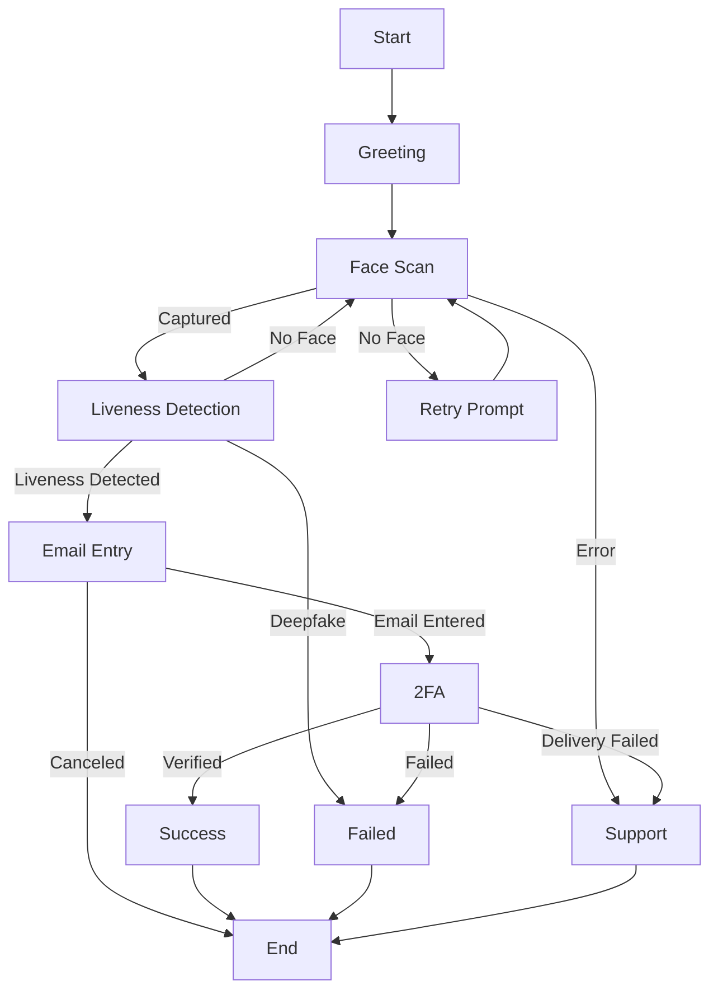

# Basic Session Example

This example demonstrates creating a complete identity verification flow with face scanning, liveness detection, and two-factor authentication.

## Full TypeScript Example

```typescript
import { Client } from '@facesignai/api'
import express from 'express'

const app = express()
const facesignClient = new Client({
  auth: process.env.FACESIGN_API_KEY
})

// Endpoint to create a verification session
app.post('/api/verify-identity', async (req, res) => {
  try {
    const { userId, email } = req.body
    
    // Create a verification session
    const { session, clientSecret } = await facesignClient.session.create({
      clientReferenceId: userId,
      metadata: {
        email,
        source: 'web-app',
        timestamp: Date.now()
      },
      customization: {
        permissionsPage: {
          mainHeading: 'Verify Your Identity',
          subheading: 'We need to verify your identity for security',
          buttonText: 'Start Verification'
        }
      },
      flow: {
        nodes: [
          // Start node
          {
            id: 'start',
            type: 'start'
          },
          
          // Greeting conversation
          {
            id: 'greeting',
            type: 'conversation',
            prompt: 'Hello! I'll help you verify your identity today. What's your full name?',
            transitions: [
              {
                id: 't1',
                condition: 'true'
              }
            ]
          },
          
          // Face scan for capture
          {
            id: 'face-scan',
            type: 'face_scan',
            mode: 'capture',
            saveToField: 'userFaceImage',
            captureInstructions: 'Please position your face in the frame and hold still',
            captureDelay: 3000,
            outcomes: {
              captured: 'liveness',
              noFace: 'face-scan-retry',
              error: 'support'
            }
          },
          
          // Retry prompt for face scan
          {
            id: 'face-scan-retry',
            type: 'conversation',
            prompt: 'I couldn't detect your face. Please make sure you're in good lighting and try again.',
            transitions: [
              {
                id: 't2',
                condition: 'true'
              }
            ]
          },
          
          // Liveness detection
          {
            id: 'liveness',
            type: 'liveness_detection',
            outcomes: {
              livenessDetected: 'email',
              deepfakeDetected: 'failed',
              noFace: 'face-scan'
            }
          },
          
          // Email collection
          {
            id: 'email',
            type: 'enter_email',
            outcomes: {
              emailEntered: '2fa',
              canceled: 'end'
            }
          },
          
          // Two-factor authentication
          {
            id: '2fa',
            type: 'two_factor',
            channels: ['email'],
            contactSource: 'session_data',
            emailTemplate: `Hello {{userName}},

Your FaceSign verification code is: {{code}}

This code will expire in 5 minutes.

Best regards,
The FaceSign Team`,
            otpLength: 6,
            expirySeconds: 300,
            maxAttempts: 3,
            outcomes: {
              verified: 'success',
              delivery_failed: 'support',
              failed_unverified: 'failed'
            }
          },
          
          // Success state
          {
            id: 'success',
            type: 'conversation',
            prompt: 'Great! Your identity has been verified successfully. Thank you for completing the verification.',
            transitions: [
              {
                id: 't3',
                condition: 'true'
              }
            ]
          },
          
          // Failed state
          {
            id: 'failed',
            type: 'conversation',
            prompt: 'We couldn't verify your identity at this time. Please contact our support team for assistance.',
            transitions: [
              {
                id: 't4',
                condition: 'true'
              }
            ]
          },
          
          // Support state
          {
            id: 'support',
            type: 'conversation',
            prompt: 'We encountered a technical issue. Please contact support@example.com or try again later.',
            transitions: [
              {
                id: 't5',
                condition: 'true'
              }
            ]
          },
          
          // End node
          {
            id: 'end',
            type: 'end'
          }
        ],
        
        edges: [
          // Main flow
          { id: 'e1', source: 'start', target: 'greeting' },
          { id: 'e2', source: 'greeting', target: 'face-scan' },
          { id: 'e3', source: 'face-scan-retry', target: 'face-scan' },
          
          // Outcome-based edges (handled by node outcomes)
          // These are automatically created based on the outcomes mapping
          
          // Terminal edges
          { id: 'e4', source: 'success', target: 'end' },
          { id: 'e5', source: 'failed', target: 'end' },
          { id: 'e6', source: 'support', target: 'end' }
        ]
      }
    })
    
    // Store session ID in database
    await db.verifications.create({
      userId,
      sessionId: session.id,
      status: session.status,
      createdAt: new Date()
    })
    
    // Return client secret to frontend
    res.json({
      sessionId: session.id,
      clientSecret: clientSecret.secret,
      url: clientSecret.url
    })
    
  } catch (error) {
    console.error('Failed to create session:', error)
    res.status(500).json({ error: 'Failed to create verification session' })
  }
})

// Webhook handler for session updates
app.post('/webhooks/facesign', express.raw({ type: 'application/json' }), async (req, res) => {
  const signature = req.headers['x-facesign-signature'] as string
  const payload = req.body.toString('utf8')
  
  // Verify signature (see webhooks guide for implementation)
  if (!verifyWebhookSignature(signature, payload, process.env.WEBHOOK_SECRET)) {
    return res.status(401).send('Invalid signature')
  }
  
  const event = JSON.parse(payload)
  
  switch (event.type) {
    case 'session.completed':
      const { session } = event.data
      
      // Update database
      await db.verifications.update({
        where: { sessionId: session.id },
        data: {
          status: 'completed',
          completedAt: new Date(),
          isVerified: session.report.isVerified,
          extractedData: session.report.extractedData
        }
      })
      
      // Send confirmation email
      if (session.report.isVerified) {
        await sendVerificationSuccessEmail(session.clientReferenceId)
      }
      break
      
    case 'session.canceled':
      await db.verifications.update({
        where: { sessionId: event.data.session.id },
        data: {
          status: 'canceled',
          canceledAt: new Date()
        }
      })
      break
  }
  
  res.status(200).send('OK')
})

app.listen(3000, () => {
  console.log('Server running on http://localhost:3000')
})
```

## Frontend Integration

```html
<!DOCTYPE html>
<html>
<head>
  <title>Identity Verification</title>
</head>
<body>
  <button id="verify-btn">Verify Identity</button>
  
  <script>
    document.getElementById('verify-btn').addEventListener('click', async () => {
      try {
        // Request session from your backend
        const response = await fetch('/api/verify-identity', {
          method: 'POST',
          headers: { 'Content-Type': 'application/json' },
          body: JSON.stringify({
            userId: 'user-123',
            email: 'user@example.com'
          })
        })
        
        const { url } = await response.json()
        
        // Redirect to FaceSign hosted flow
        window.location.href = url
        
      } catch (error) {
        console.error('Failed to start verification:', error)
      }
    })
  </script>
</body>
</html>
```

## Flow Diagram



## Key Features Demonstrated

1. **Multi-step Flow** - Combines multiple verification methods
2. **Error Handling** - Graceful fallbacks for each failure case
3. **Retry Logic** - Allows users to retry failed steps
4. **Custom Messages** - Personalized prompts throughout
5. **Webhook Integration** - Real-time status updates
6. **Database Sync** - Tracks verification state

## Testing Tips

1. Use test API keys (`sk_test_*`) during development
2. Test each outcome path:
   - Successful verification
   - Face not detected
   - Liveness check failure
   - 2FA code incorrect
3. Monitor webhook events in the dashboard
4. Check session reports for detailed information

## Next Steps

- [REST Client Examples](/examples/rest-client) - Try the API interactively
- [Node Types Reference](/concepts/node-graph) - Learn about all available nodes
- [Customization Options](/guides/customization) - Personalize the UI/UX 