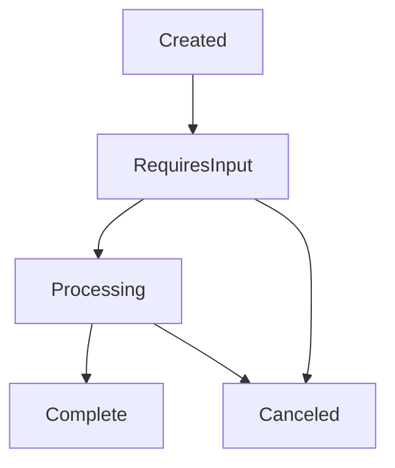

import { Callout } from 'nextra/components'

# Sessions

A session represents a single identity verification flow in FaceSign. Each session has a unique ID, contains all configuration for the verification process, and tracks the user's progress through the flow.

## Session Lifecycle



## Session States

Sessions progress through the following states:

| Status | Description | Next States |
|--------|-------------|-------------|
| `requiresInput` | Session is active and waiting for user interaction | `processing`, `canceled` |
| `processing` | Session is processing user input or performing verification | `requiresInput`, `complete`, `canceled` |
| `complete` | Session has finished successfully | None (terminal state) |
| `canceled` | Session was canceled by user or system | None (terminal state) |

## Creating Sessions

Sessions are created with the `client.session.create()` method:

```typescript
const response = await client.session.create({
  clientReferenceId: 'user-123',
  metadata: { source: 'web-app' },
  flow: {
    nodes: [...],
    edges: [...]
  }
})

// Response includes:
// - session: The created session object
// - clientSecret: Authentication for the end user
```

## Session Properties

### Core Properties

| Property | Type | Description |
|----------|------|-------------|
| `id` | string | Unique session identifier |
| `createdAt` | number | Unix timestamp of creation |
| `startedAt` | number? | When user began the session |
| `finishedAt` | number? | When session completed/canceled |
| `status` | SessionStatus | Current session state |
| `version` | string | API version used |

### Settings

Sessions are configured through the `settings` object:

```typescript
interface SessionSettings {
  clientReferenceId: string      // Your internal user ID
  metadata: object              // Custom data (max 50KB)
  providedData?: Record<string, string>  // Pre-filled user data
  flow?: FSFlow                 // Node-based flow configuration
  modules?: Module[]            // Legacy module configuration
  customization?: Customization // UI/UX customization
  
  // Language settings
  langs?: string[]             // Available languages
  defaultLang?: string         // Default language
  
  // Avatar settings
  avatarId?: string            // Specific avatar to use
  initialPhrase?: string       // Opening message
  finalPhrase?: string         // Closing message
}
```

<Callout type="info">
  You must provide either `flow` (recommended) or `modules` (legacy) to configure the verification process.
</Callout>

## Session Reports

Completed sessions include a detailed report:

```typescript
interface SessionReport {
  transcript: Phrase[]           // Full conversation history
  location?: Location            // Geolocation data
  device?: Device               // Device fingerprint
  extractedData?: Record<string, string>  // Data collected
  
  // Verification results
  livenessDetected?: boolean    // Liveness check result
  isVerified?: boolean          // Overall verification status
  
  // Media
  screenshots?: string[]        // Captured screenshots
  videos?: {
    avatarVideoUrl?: string   // Avatar recording
    userVideoUrl?: string     // User recording
  }
  
  // AI Analysis
  aiAnalysis?: {
    ageMin: number
    ageMax: number
    sex: 'male' | 'female'
    realPersonOrVirtual: 'real' | 'virtual' | 'noface'
    overallSummary: string
    analysis: Array<{
      title: string
      shortDescription: string
      longDescription: string
    }>
  }
}
```

## Retrieving Sessions

Get session details and status:

```typescript
const response = await client.session.retrieve({
  sessionId: 'session_abc123'
})

// Check status
if (response.session.status === 'complete') {
  console.log('Verification results:', response.session.report)
}
```

## Listing Sessions

Query multiple sessions with filtering:

```typescript
const sessions = await client.session.list({
  limit: 25,
  status: ['complete', 'canceled'],
  fromDate: Date.now() - 86400000, // Last 24 hours
  sortBy: 'createdAt',
  sortOrder: 'desc'
})
```

### List Parameters

| Parameter | Type | Description |
|-----------|------|-------------|
| `limit` | number | Max results per page (default: 25, max: 100) |
| `cursor` | string | Pagination cursor |
| `flowId` | string | Filter by flow/form ID |
| `clientReferenceId` | string | Filter by your reference ID |
| `status` | string[] | Filter by status(es) |
| `fromDate` | number | Start date (Unix timestamp) |
| `toDate` | number | End date (Unix timestamp) |
| `sortBy` | string | Sort field: `createdAt`, `status`, `finishedAt` |
| `sortOrder` | string | Sort direction: `asc` or `desc` |
| `search` | string | Search in metadata |

## Session URLs

Each session has a unique URL where users complete the verification:

```typescript
const sessionUrl = response.clientSecret.url
// https://verify.facesign.ai/s/abc123...

// Direct user to this URL via:
// - Redirect: window.location.href = sessionUrl
// - New tab: window.open(sessionUrl, '_blank')
// - Iframe: <iframe src={sessionUrl} />
```

## Session Expiration

- Sessions expire **7 days** after creation if not completed
- Client secrets expire **24 hours** after creation
- Completed sessions are retained based on your plan

<Callout type="warning">
  Always handle session expiration gracefully. Check the session status before assuming it's still valid.
</Callout>

## Best Practices

1. **Store session IDs** - Keep the session ID in your database linked to your user
2. **Use metadata wisely** - Store searchable data in metadata for easy filtering
3. **Handle all states** - Your application should handle all possible session states
4. **Monitor completion** - Use webhooks to get real-time updates on session completion
5. **Set appropriate timeouts** - Consider your use case when setting session timeouts

## Example: Complete Session Flow

```typescript
// 1. Create session
const { session, clientSecret } = await client.session.create({
  clientReferenceId: 'user-789',
  metadata: {
    purpose: 'account-verification',
    tier: 'premium'
  },
  flow: { /* ... */ }
})

// 2. Store session ID
await saveToDatabase({
  userId: 'user-789',
  sessionId: session.id,
  createdAt: session.createdAt
})

// 3. Send user to verification
sendEmail(user.email, {
  subject: 'Verify your identity',
  body: `Click here to verify: ${clientSecret.url}`
})

// 4. Check status (via webhook or polling)
const checkStatus = async () => {
  const { session } = await client.session.retrieve({
    sessionId: session.id
  })
  
  if (session.status === 'complete') {
    console.log('Verified!', session.report)
    await updateUserStatus(user.id, 'verified')
  }
}
```

## Next Steps

- Learn about [Node Graphs](/concepts/node-graph) to build verification flows
- Understand [Client Secrets](/concepts/client-secrets) for secure access
- Explore [Customization](/concepts/customization) options 