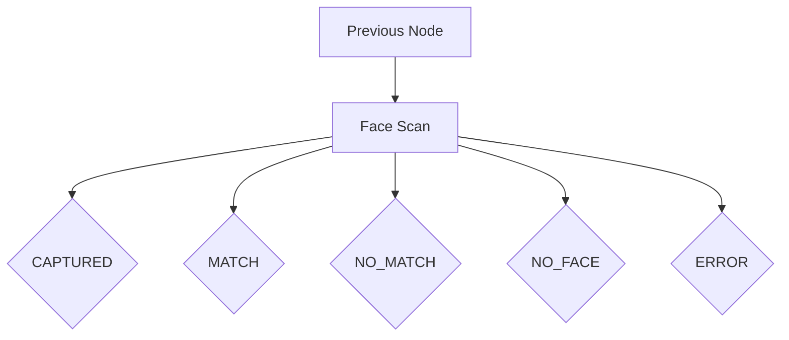

import { Tabs } from 'nextra/components'
import { Callout } from 'nextra/components'

# Face Scan Node

The Face Scan node captures facial images and optionally performs 1:1 face matching against a reference image.

## Overview



## Type Definition

```typescript
interface FSFaceScanNode extends FSNodeBase {
  type: FSNodeType.FACE_SCAN
  outcomes: Record<FSFaceScanOutcome, FSTransitionId>
  
  // Core configuration
  mode: FSFaceScanMode // 'capture' or 'compare'
  
  // Capture configuration
  captureInstructions?: string
  saveToField?: string
  requireLiveness?: boolean
  
  // Compare configuration (when mode === 'compare')
  referenceImageSource?: 'session' | 'providedData' | 'url'
  referenceImageKey?: string
  referenceImageUrl?: string
  similarityThreshold?: number
  
  // Advanced configuration
  captureDelay?: number
  detectionInterval?: number
  qualityThreshold?: number
  blurThreshold?: number
  minFaceSize?: number
  maxFaceSize?: number
  enableSound?: boolean
  enableHaptics?: boolean
  useWebGL?: boolean
  maxRetries?: number
}
```

## Modes

The Face Scan node operates in two modes:

### Capture Mode
Only captures a face image without comparison:
- Stores the captured image URL in session data
- Useful for collecting face images for later processing
- Returns `CAPTURED` outcome on success

### Compare Mode
Captures and compares against a reference image:
- Performs 1:1 face matching
- Returns `MATCH` or `NO_MATCH` based on similarity
- Requires a reference image source

## Properties

### Core Properties

| Property | Type | Required | Default | Description |
|----------|------|----------|---------|-------------|
| `id` | string | ✅ | - | Unique node identifier |
| `type` | `FACE_SCAN` | ✅ | - | Node type constant |
| `mode` | `'capture' \| 'compare'` | ✅ | - | Operation mode |
| `outcomes` | object | ✅ | - | Outcome-to-node mapping |

### Capture Configuration

| Property | Type | Required | Default | Description |
|----------|------|----------|---------|-------------|
| `captureInstructions` | string | ❌ | "Position your face in the frame" | User instructions |
| `saveToField` | string | ❌ | "faceImageUrl" | Field name for storing captured image |
| `requireLiveness` | boolean | ❌ | false | Require liveness check during capture |

### Compare Configuration

| Property | Type | Required | Default | Description |
|----------|------|----------|---------|-------------|
| `referenceImageSource` | string | ❌* | - | Source of reference image |
| `referenceImageKey` | string | ❌* | - | Key for session/providedData source |
| `referenceImageUrl` | string | ❌* | - | Direct URL to reference image |
| `similarityThreshold` | number | ❌ | 0.8 | Match threshold (0-1) |

*Required when `mode === 'compare'`

### Advanced Configuration

| Property | Type | Default | Description |
|----------|------|---------|-------------|
| `captureDelay` | number | 3000 | Countdown before capture (ms) |
| `detectionInterval` | number | 150 | Face detection frequency (ms) |
| `qualityThreshold` | number | 0.7 | Minimum face quality (0-1) |
| `blurThreshold` | number | 50 | Blur detection (lower = stricter) |
| `minFaceSize` | number | 100 | Minimum face size (pixels) |
| `maxFaceSize` | number | 400 | Maximum face size (pixels) |
| `enableSound` | boolean | true | Audio feedback |
| `enableHaptics` | boolean | true | Haptic feedback (mobile) |
| `useWebGL` | boolean | true | GPU acceleration |
| `maxRetries` | number | 3 | Maximum capture attempts |

## Outcomes

| Outcome | Mode | Description |
|---------|------|-------------|
| `CAPTURED` | capture | Face successfully captured |
| `MATCH` | compare | Faces match above threshold |
| `NO_MATCH` | compare | Faces don't match |
| `NO_FACE` | both | No face detected |
| `ERROR` | both | Technical error occurred |

## Configuration Examples

<Tabs items={['Capture Only', 'Compare with Session', 'Compare with URL', 'Advanced']}>
  <Tabs.Tab>
```typescript
{
  id: 'face-capture',
  type: FSNodeType.FACE_SCAN,
  mode: 'capture',
  saveToField: 'userFaceImage',
  captureInstructions: 'Please look at the camera',
  outcomes: {
    captured: 'next-step',
    noFace: 'retry',
    error: 'support'
  }
}
```
  </Tabs.Tab>
  
  <Tabs.Tab>
```typescript
{
  id: 'face-verify',
  type: FSNodeType.FACE_SCAN,
  mode: 'compare',
  referenceImageSource: 'session',
  referenceImageKey: 'enrolledFaceUrl',
  similarityThreshold: 0.85,
  outcomes: {
    match: 'verified',
    noMatch: 'failed',
    noFace: 'retry',
    error: 'support'
  }
}
```
  </Tabs.Tab>
  
  <Tabs.Tab>
```typescript
{
  id: 'face-match',
  type: FSNodeType.FACE_SCAN,
  mode: 'compare',
  referenceImageSource: 'url',
  referenceImageUrl: 'https://example.com/reference.jpg',
  similarityThreshold: 0.9,
  outcomes: {
    match: 'access-granted',
    noMatch: 'access-denied',
    noFace: 'retry',
    error: 'manual-review'
  }
}
```
  </Tabs.Tab>
  
  <Tabs.Tab>
```typescript
{
  id: 'secure-face-scan',
  type: FSNodeType.FACE_SCAN,
  mode: 'compare',
  referenceImageSource: 'session',
  referenceImageKey: 'trustedFace',
  
  // Strict quality requirements
  qualityThreshold: 0.9,
  blurThreshold: 30,
  minFaceSize: 150,
  maxFaceSize: 350,
  
  // Quick capture
  captureDelay: 1000,
  detectionInterval: 100,
  
  // User experience
  enableSound: true,
  enableHaptics: true,
  maxRetries: 5,
  captureInstructions: 'Hold still for verification',
  
  outcomes: {
    match: 'authenticated',
    noMatch: 'unauthorized',
    noFace: 'position-face',
    error: 'fallback'
  }
}
```
  </Tabs.Tab>
</Tabs>

## Reference Image Sources

### Session Data (`'session'`)
Uses an image URL stored in the current session's data:
```typescript
referenceImageSource: 'session',
referenceImageKey: 'enrollmentPhoto'
```

### Provided Data (`'providedData'`)
Uses an image URL from the session's initial `providedData`:
```typescript
referenceImageSource: 'providedData',
referenceImageKey: 'employeePhoto'
```

### Direct URL (`'url'`)
Uses a hardcoded image URL:
```typescript
referenceImageSource: 'url',
referenceImageUrl: 'https://secure.example.com/photos/user123.jpg'
```

## Usage Notes

<Callout type="info">
  Face Scan consumes approximately 1 credit per capture/comparison.
</Callout>

### Best Practices

1. **Set appropriate thresholds** - Higher thresholds (0.85+) for security-critical applications
2. **Handle poor lighting** - Provide clear instructions for optimal conditions
3. **Consider mobile users** - Enable haptic feedback for better UX
4. **Plan for failures** - Always define paths for `NO_FACE` and `ERROR` outcomes
5. **Test quality settings** - Balance between security and user experience

### Performance Tips

- Use `useWebGL: true` for better performance on capable devices
- Increase `detectionInterval` on lower-end devices
- Adjust `minFaceSize` based on expected device distance
- Lower `qualityThreshold` in challenging environments

### Security Considerations

- Store reference images securely
- Use HTTPS URLs for reference images
- Consider adding liveness detection for high-security scenarios
- Implement rate limiting for face comparison attempts

## Complete Example

Here's a complete face verification flow:

```typescript
{
  nodes: [
    { id: 'start', type: FSNodeType.START },
    
    // Initial enrollment capture
    {
      id: 'enroll',
      type: FSNodeType.FACE_SCAN,
      mode: 'capture',
      saveToField: 'enrolledFace',
      captureInstructions: 'Let\'s capture your face for future verification',
      outcomes: {
        captured: 'confirm',
        noFace: 'enroll', // Retry
        error: 'support'
      }
    },
    
    // Confirmation
    {
      id: 'confirm',
      type: FSNodeType.CONVERSATION,
      prompt: 'Face captured! Now let\'s verify it\'s really you.',
      transitions: [{ id: 't1', condition: 'true' }]
    },
    
    // Verification
    {
      id: 'verify',
      type: FSNodeType.FACE_SCAN,
      mode: 'compare',
      referenceImageSource: 'session',
      referenceImageKey: 'enrolledFace',
      similarityThreshold: 0.85,
      captureInstructions: 'Look at the camera to verify',
      outcomes: {
        match: 'success',
        noMatch: 'verify', // Retry
        noFace: 'verify',  // Retry
        error: 'support'
      }
    },
    
    // Success
    {
      id: 'success',
      type: FSNodeType.CONVERSATION,
      prompt: 'Perfect match! Identity verified.',
      transitions: [{ id: 't2', condition: 'true' }]
    },
    
    // Support fallback
    {
      id: 'support',
      type: FSNodeType.CONVERSATION,
      prompt: 'We encountered an issue. Please contact support.',
      transitions: [{ id: 't3', condition: 'true' }]
    },
    
    { id: 'end', type: FSNodeType.END }
  ],
  
  edges: [
    { id: 'e1', source: 'start', target: 'enroll' },
    { id: 'e2', source: 'enroll', target: 'confirm' },
    { id: 'e3', source: 'enroll', target: 'support' },
    { id: 'e4', source: 'confirm', target: 'verify' },
    { id: 'e5', source: 'verify', target: 'success' },
    { id: 'e6', source: 'verify', target: 'support' },
    { id: 'e7', source: 'success', target: 'end' },
    { id: 'e8', source: 'support', target: 'end' }
  ]
}
```

## Related Nodes

- [Liveness Detection](/nodes/liveness-detection) - Ensure real person
- [Recognition](/nodes/recognition) - 1:N face matching
- [Document Scan](/nodes/document-scan) - Capture ID photos 