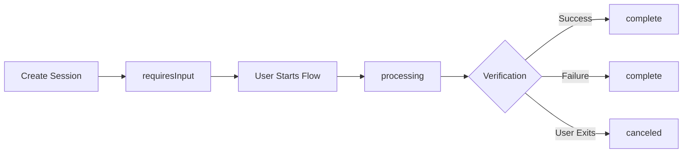

export const metadata = {
  title: 'Sessions',
  description: 'Learn how to create and manage verification sessions with the FaceSign API.',
}

# Sessions

Sessions are the core of FaceSign's identity verification platform. A session represents a single identity verification flow that guides users through various verification steps like conversational AI interactions, biometric checks, document scanning, and multi-factor authentication. {{ className: 'lead' }}

## How FaceSign Sessions Work

FaceSign sessions work similarly to how Stripe handles payments. When you integrate FaceSign:

1. **Create a session** using the FaceSign API and get a session object + client secret
2. **Save the session** to your own database for tracking
3. **Provide the client secret** to the FaceSign frontend (web or mobile)
4. **Listen for webhooks** that inform you about session progress and completion
5. **Update your database** when webhooks arrive with the latest session status
6. **Build your app logic** using the session data stored in your database

This approach gives you several benefits:
- **Faster performance** - No need to call external APIs repeatedly
- **Better reliability** - Your app doesn't depend on external API availability
- **Enhanced control** - All verification data is available in your database for queries and business logic
- **Audit trail** - Complete history of verification attempts and results

---

## Create a session

<ApiEndpoint 
  method="POST" 
  path="/v1/sessions" 
  description="Create a new verification session with specified modules or custom flow">

Create a verification session by providing configuration settings. You can use either predefined modules or a custom flow, but not both.

<CodeGroup>

```typescript {{ title: 'Using Modules' }}
const session = await client.sessions.create({
  clientReferenceId: 'user-123',
  metadata: { userId: '123', source: 'web' },
  modules: [
    { type: 'identityVerification' },
    { type: 'documentAuthentication' }
  ],
  customization: {
    branding: {
      primaryColor: '#007bff',
      logoUrl: 'https://your-domain.com/logo.png'
    }
  }
})
```

```typescript {{ title: 'Using Custom Flow' }}
const session = await client.sessions.create({
  clientReferenceId: 'user-456',
  flow: {
    nodes: [
      { id: 'start', type: 'start' },
      { 
        id: 'liveness', 
        type: 'liveness_detection',
        outcomes: {
          livenessDetected: 'document',
          deepfakeDetected: 'end'
        }
      },
      { id: 'document', type: 'document_scan' },
      { id: 'end', type: 'end' }
    ],
    edges: [
      { id: 'e1', source: 'start', target: 'liveness' },
      { id: 'e2', source: 'liveness', target: 'document' },
      { id: 'e3', source: 'document', target: 'end' }
    ]
  }
})
```

```bash {{ title: 'cURL' }}
curl https://api.facesign.ai/v1/sessions \
  -H "Authorization: Bearer sk_test_..." \
  -H "Content-Type: application/json" \
  -d '{
    "clientReferenceId": "user-123",
    "modules": [
      { "type": "identityVerification" },
      { "type": "documentAuthentication" }
    ]
  }'
```

</CodeGroup>

<ResponsePreview 
  responses={[
    {
      status: 201,
      description: "Session created successfully",
      example: {
        id: "vs_1a2b3c4d5e6f",
        clientSecret: "vs_1a2b3c4d5e6f_secret_abc123def456",
        createdAt: 1640995200,
        status: "requiresInput",
        settings: {
          clientReferenceId: "user-123",
          metadata: { userId: "123", source: "web" },
          modules: [
            { type: "identityVerification" },
            { type: "documentAuthentication" }
          ]
        },
        version: "2024-12-18"
      }
    },
    {
      status: 400,
      description: "Invalid request parameters",
      example: {
        error: {
          type: "invalid_request_error",
          message: "Cannot specify both modules and flow in the same request",
          param: "modules"
        }
      }
    }
  ]}
/>

</ApiEndpoint>

---

## The session model

The session model contains all the information about a verification session, including its configuration, status, and results.

### Properties

<Properties>
  <Property name="id" type="string">
    Unique identifier for the session.
  </Property>
  <Property name="createdAt" type="number">
    Unix timestamp when the session was created.
  </Property>
  <Property name="startedAt" type="number">
    Unix timestamp when the user began the verification flow.
  </Property>
  <Property name="finishedAt" type="number">
    Unix timestamp when the session was completed or cancelled.
  </Property>
  <Property name="status" type="string">
    Current status: `requiresInput`, `processing`, `complete`, or `canceled`.
  </Property>
  <Property name="settings" type="object">
    Configuration object containing modules, customization, and flow settings.
  </Property>
  <Property name="version" type="string">
    API version used for this session.
  </Property>
  <Property name="report" type="object">
    Results of the verification including AI analysis, extracted data, and verification status.
  </Property>
</Properties>

### Session Settings

<Properties>
  <Property name="clientReferenceId" type="string">
    Your internal reference ID to link this session to your user.
  </Property>
  <Property name="metadata" type="object">
    Key-value pairs for storing additional information about the session.
  </Property>
  <Property name="initialPhrase" type="string">
    Optional custom greeting message for the AI avatar.
  </Property>
  <Property name="finalPhrase" type="string">
    Optional custom closing message for the AI avatar.
  </Property>
  <Property name="providedData" type="object">
    Pre-filled data to pass to the verification flow.
  </Property>
  <Property name="avatarId" type="string">
    ID of the AI avatar to use for conversational interactions.
  </Property>
  <Property name="langs" type="array">
    Array of supported language codes for this session.
  </Property>
  <Property name="defaultLang" type="string">
    Default language code if user's preference isn't available.
  </Property>
  <Property name="zone" type="string">
    Geographic zone: `es` (United States) or `eu` (European Union).
  </Property>
  <Property name="modules" type="array">
    Array of verification modules to include in this session.
  </Property>
  <Property name="flow" type="object">
    Custom node-based flow definition (optional).
  </Property>
  <Property name="customization" type="object">
    UI customization options including colors, fonts, and branding.
  </Property>
</Properties>

### Session Report

When a session is completed, the `report` object contains detailed verification results:

<Properties>
  <Property name="transcript" type="array">
    Conversation transcript between user and AI avatar.
  </Property>
  <Property name="aiAnalysis" type="object">
    AI-powered analysis including age estimation, gender detection, and authenticity assessment.
  </Property>
  <Property name="location" type="object">
    User's location information (if available and consented).
  </Property>
  <Property name="device" type="object">
    Device information and browser details.
  </Property>
  <Property name="livenessDetected" type="boolean">
    Whether liveness was detected during biometric verification.
  </Property>
  <Property name="lang" type="string">
    Language used during the verification session.
  </Property>
  <Property name="extractedData" type="object">
    Data extracted from documents or user input during verification.
  </Property>
  <Property name="screenshots" type="array">
    Array of screenshot URLs captured during verification.
  </Property>
  <Property name="videos" type="object">
    URLs for avatar and user video recordings.
  </Property>
  <Property name="isVerified" type="boolean">
    Overall verification result - true if verification was successful.
  </Property>
</Properties>

---

## Create a session {{ tag: 'POST', label: '/sessions' }}

<Row>
  <Col>

    Creates a new verification session. The response includes both the session object and a client secret for frontend integration.

    ### Required attributes

    <Properties>
      <Property name="clientReferenceId" type="string">
        Your internal reference ID to link this session to your user.
      </Property>
      <Property name="modules" type="array">
        Array of verification modules to include. Each module has a `type` and configuration options.
      </Property>
    </Properties>

    ### Optional attributes

    <Properties>
      <Property name="metadata" type="object">
        Key-value pairs for storing additional information about the session.
      </Property>
      <Property name="initialPhrase" type="string">
        Custom greeting message for the AI avatar.
      </Property>
      <Property name="finalPhrase" type="string">
        Custom closing message for the AI avatar.
      </Property>
      <Property name="providedData" type="object">
        Pre-filled data to pass to the verification flow.
      </Property>
      <Property name="avatarId" type="string">
        ID of the AI avatar to use. Get available avatars from `/avatars` endpoint.
      </Property>
      <Property name="langs" type="array">
        Array of supported language codes. Get available languages from `/langs` endpoint.
      </Property>
      <Property name="defaultLang" type="string">
        Default language code (defaults to 'en').
      </Property>
      <Property name="zone" type="string">
        Geographic zone: `es` or `eu` (defaults to 'es').
      </Property>
      <Property name="flow" type="object">
        Custom node-based flow definition for advanced use cases.
      </Property>
      <Property name="customization" type="object">
        UI customization options including colors and branding.
      </Property>
    </Properties>

  </Col>
  <Col sticky>

    <CodeGroup title="Request" tag="POST" label="/sessions">

    ```bash {{ title: 'cURL' }}
    curl https://api.facesign.ai/sessions \
      -H "Authorization: Bearer fs_live_..." \
      -H "Content-Type: application/json" \
      -d '{
        "clientReferenceId": "user_123",
        "metadata": {
          "user_id": "usr_abc123",
          "verification_type": "onboarding"
        },
        "modules": [
          {
            "type": "identityVerification"
          },
          {
            "type": "emailVerification",
            "email": "user@example.com"
          }
        ]
      }'
    ```

    ```typescript {{ title: 'TypeScript' }}
    import { FaceSignClient } from '@facesign/api';

    const client = new FaceSignClient({
      auth: process.env.FACESIGN_API_KEY,
    });

    const { session, clientSecret } = await client.sessions.create({
      clientReferenceId: 'user_123',
      metadata: {
        user_id: 'usr_abc123',
        verification_type: 'onboarding'
      },
      modules: [
        { type: 'identityVerification' },
        { 
          type: 'emailVerification',
          email: 'user@example.com'
        }
      ]
    });

    // Save to your database
    await db.verifications.create({
      sessionId: session.id,
      userId: 'user_123',
      status: session.status,
      createdAt: new Date(session.createdAt * 1000)
    });

    // Return client secret to frontend
    return { clientSecret: clientSecret.secret };
    ```

    ```python {{ title: 'Python' }}
    import facesign

    client = facesign.Client(api_key="fs_live_...")

    response = client.sessions.create(
        client_reference_id="user_123",
        metadata={
            "user_id": "usr_abc123",
            "verification_type": "onboarding"
        },
        modules=[
            {"type": "identityVerification"},
            {
                "type": "emailVerification",
                "email": "user@example.com"
            }
        ]
    )

    session = response.session
    client_secret = response.client_secret
    ```

    </CodeGroup>

    ```json {{ title: 'Response' }}
    {
      "session": {
        "id": "fs_session_abc123",
        "createdAt": 1706284800,
        "status": "requiresInput",
        "settings": {
          "clientReferenceId": "user_123",
          "metadata": {
            "user_id": "usr_abc123",
            "verification_type": "onboarding"
          },
          "modules": [
            { "type": "identityVerification" },
            { 
              "type": "emailVerification",
              "email": "user@example.com"
            }
          ],
          "defaultLang": "en",
          "zone": "es"
        }
      },
      "clientSecret": {
        "secret": "fs_client_secret_xyz789",
        "createdAt": 1706284800,
        "expireAt": 1706288400,
        "url": "https://verify.facesign.ai/?client_secret=fs_client_secret_xyz789"
      }
    }
    ```

  </Col>
</Row>

---

## Retrieve a session {{ tag: 'GET', label: '/sessions/:id' }}

<Row>
  <Col>

    Retrieves the details of an existing session, including any verification results if the session has been completed.

  </Col>
  <Col sticky>

    <CodeGroup title="Request" tag="GET" label="/sessions/fs_session_abc123">

    ```bash {{ title: 'cURL' }}
    curl https://api.facesign.ai/sessions/fs_session_abc123 \
      -H "Authorization: Bearer fs_live_..."
    ```

    ```typescript {{ title: 'TypeScript' }}
    const { session, clientSecret } = await client.sessions.retrieve('fs_session_abc123');
    
    // Update your database with latest status
    await db.verifications.update({
      where: { sessionId: session.id },
      data: {
        status: session.status,
        finishedAt: session.finishedAt ? new Date(session.finishedAt * 1000) : null,
        isVerified: session.report?.isVerified || false
      }
    });
    ```

    ```python {{ title: 'Python' }}
    response = client.sessions.retrieve("fs_session_abc123")
    session = response.session
    client_secret = response.client_secret
    ```

    </CodeGroup>

    ```json {{ title: 'Response' }}
    {
      "session": {
        "id": "fs_session_abc123",
        "createdAt": 1706284800,
        "startedAt": 1706284850,
        "finishedAt": 1706285200,
        "status": "complete",
        "settings": { /* session settings */ },
        "report": {
          "isVerified": true,
          "livenessDetected": true,
          "extractedData": {
            "firstName": "John",
            "lastName": "Doe",
            "email": "user@example.com"
          },
          "aiAnalysis": {
            "ageMin": 25,
            "ageMax": 30,
            "sex": "male",
            "realPersonOrVirtual": "real",
            "overallSummary": "Verification successful with high confidence"
          }
        }
      },
      "clientSecret": {
        "secret": "fs_client_secret_xyz789",
        "createdAt": 1706284800,
        "expireAt": 1706288400,
        "url": "https://verify.facesign.ai/?client_secret=fs_client_secret_xyz789"
      }
    }
    ```

  </Col>
</Row>

---

## Refresh client secret {{ tag: 'GET', label: '/sessions/:id/refresh' }}

<Row>
  <Col>

    Generates a new client secret for an existing session. This is useful if the original client secret has expired or been compromised. Note that old client secrets are immediately invalidated when a new one is generated.

  </Col>
  <Col sticky>

    <CodeGroup title="Request" tag="GET" label="/sessions/fs_session_abc123/refresh">

    ```bash {{ title: 'cURL' }}
    curl https://api.facesign.ai/sessions/fs_session_abc123/refresh \
      -H "Authorization: Bearer fs_live_..."
    ```

    ```typescript {{ title: 'TypeScript' }}
    const { clientSecret } = await client.sessions.refreshSecret('fs_session_abc123');
    
    // Provide new client secret to frontend
    return { clientSecret: clientSecret.secret };
    ```

    ```python {{ title: 'Python' }}
    response = client.sessions.refresh_secret("fs_session_abc123")
    client_secret = response.client_secret
    ```

    </CodeGroup>

    ```json {{ title: 'Response' }}
    {
      "clientSecret": {
        "secret": "fs_client_secret_new456",
        "createdAt": 1706285000,
        "expireAt": 1706288600,
        "url": "https://verify.facesign.ai/?client_secret=fs_client_secret_new456"
      }
    }
    ```

  </Col>
</Row>

---

## Session lifecycle

Understanding the session lifecycle helps you build a robust integration. Here's how sessions progress through their states:



### Session statuses

- **`requiresInput`** - Session created, waiting for user to begin verification
- **`processing`** - User is actively going through the verification flow
- **`complete`** - Verification finished (check `report.isVerified` for success/failure)
- **`canceled`** - Session was cancelled by user or expired

### Handling results with webhooks

The recommended approach is to use webhooks to get real-time updates about session status changes:

```typescript {{ title: 'Webhook handler' }}
app.post('/webhooks/facesign', async (req, res) => {
  const { type, data } = req.body;
  
  if (type === 'session.completed') {
    const session = data.session;
    
    // Update your database
    await db.verifications.update({
      where: { sessionId: session.id },
      data: {
        status: session.status,
        finishedAt: new Date(session.finishedAt * 1000),
        isVerified: session.report?.isVerified || false,
        extractedData: session.report?.extractedData || {}
      }
    });
    
    // Trigger your business logic
    if (session.report?.isVerified) {
      await approveUserAccount(session.settings.clientReferenceId);
      await sendWelcomeEmail(session.settings.clientReferenceId);
    } else {
      await flagUserForReview(session.settings.clientReferenceId);
    }
  }
  
  res.status(200).send('OK');
});
```

## Integration best practices

### 1. Database-First Approach

Store session data in your database immediately after creation:

```typescript
// Create session and store in your DB
const { session, clientSecret } = await client.sessions.create(config);

await db.verifications.create({
  id: generateId(),
  sessionId: session.id,
  userId: userId,
  status: session.status,
  clientReferenceId: session.settings.clientReferenceId,
  createdAt: new Date(session.createdAt * 1000),
  metadata: session.settings.metadata
});

// Return client secret to frontend
return { clientSecret: clientSecret.secret };
```

### 2. Use Webhooks for Real-Time Updates

Don't poll the API for session updates. Use webhooks instead:

```typescript
// ❌ Don't do this - polling is slow and inefficient
setInterval(async () => {
  const { session } = await client.sessions.retrieve(sessionId);
  updateDatabase(session);
}, 5000);

// ✅ Do this - use webhooks for real-time updates
app.post('/webhooks/facesign', handleWebhook);
```

### 3. Handle Client Secret Expiration

Client secrets expire after 1 hour. Handle expiration gracefully:

```typescript
async function getValidClientSecret(sessionId: string) {
  const session = await db.verifications.findUnique({
    where: { sessionId }
  });
  
  if (!session.clientSecret || isExpired(session.clientSecretExpiry)) {
    const { clientSecret } = await client.sessions.refreshSecret(sessionId);
    
    await db.verifications.update({
      where: { sessionId },
      data: {
        clientSecret: clientSecret.secret,
        clientSecretExpiry: new Date(clientSecret.expireAt * 1000)
      }
    });
    
    return clientSecret.secret;
  }
  
  return session.clientSecret;
}
```

### 4. Link Sessions to Your Users

Always use `clientReferenceId` to link sessions to your users:

```typescript
const { session, clientSecret } = await client.sessions.create({
  clientReferenceId: user.id, // Your internal user ID
  metadata: {
    email: user.email,
    signupDate: user.createdAt.toISOString(),
    source: 'web_signup'
  },
  modules: [{ type: 'identityVerification' }]
});
```

### 5. Build Logic on Your Database

Query your own database for verification status, don't call the API repeatedly:

```typescript
// ✅ Query your database
async function getUserVerificationStatus(userId: string) {
  return await db.verifications.findFirst({
    where: { 
      userId,
      status: 'complete'
    },
    orderBy: { createdAt: 'desc' }
  });
}

// Use in your application logic
const verification = await getUserVerificationStatus(userId);
if (verification?.isVerified) {
  // Allow access to premium features
}
``` 